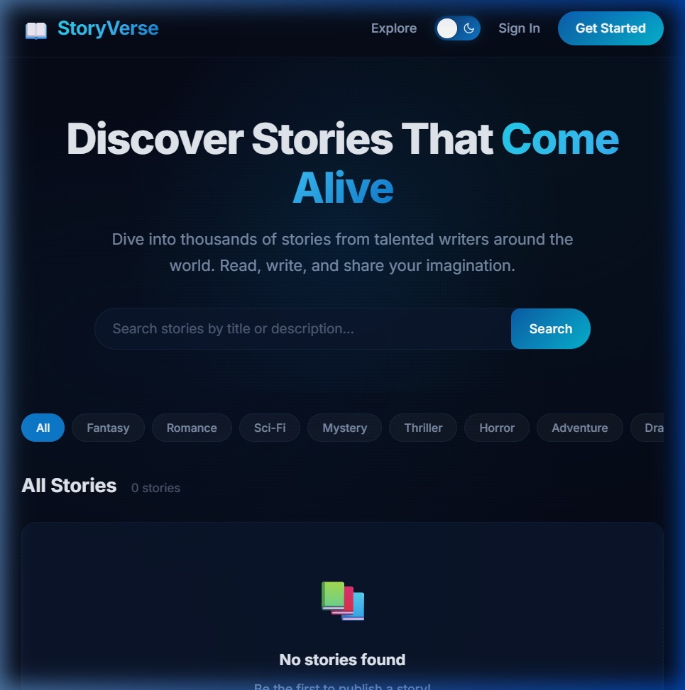
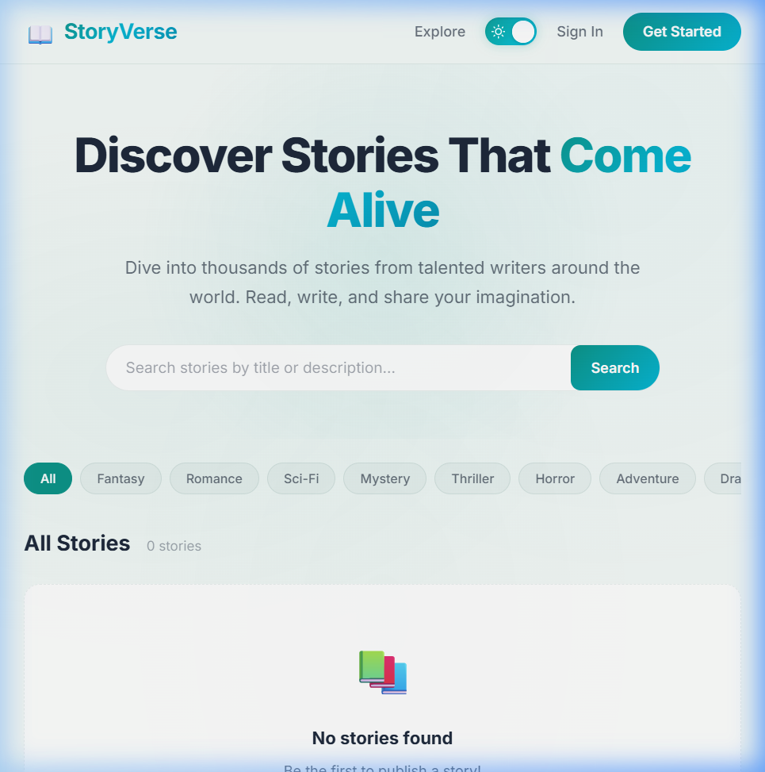
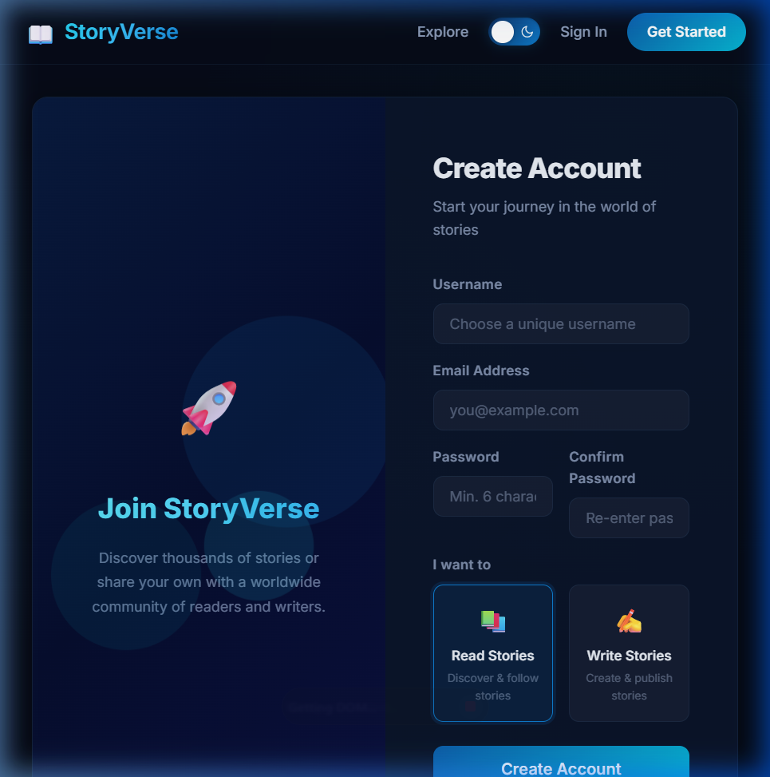
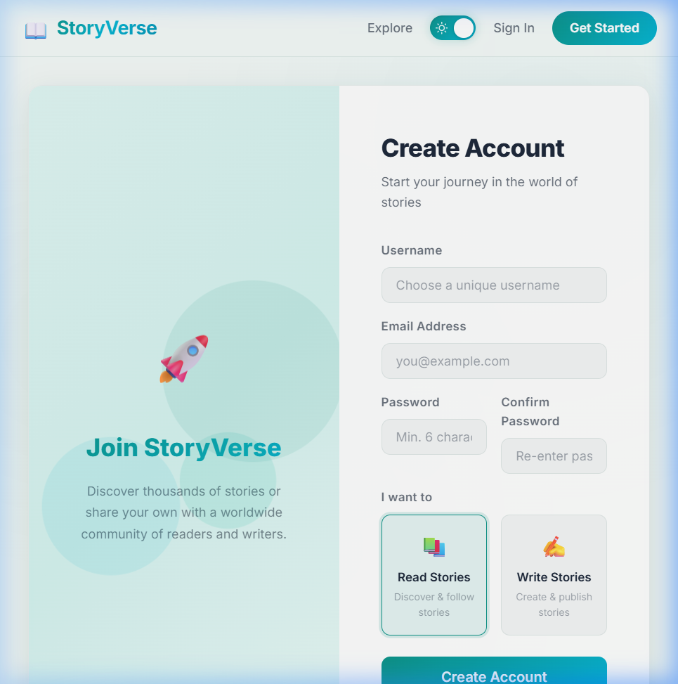
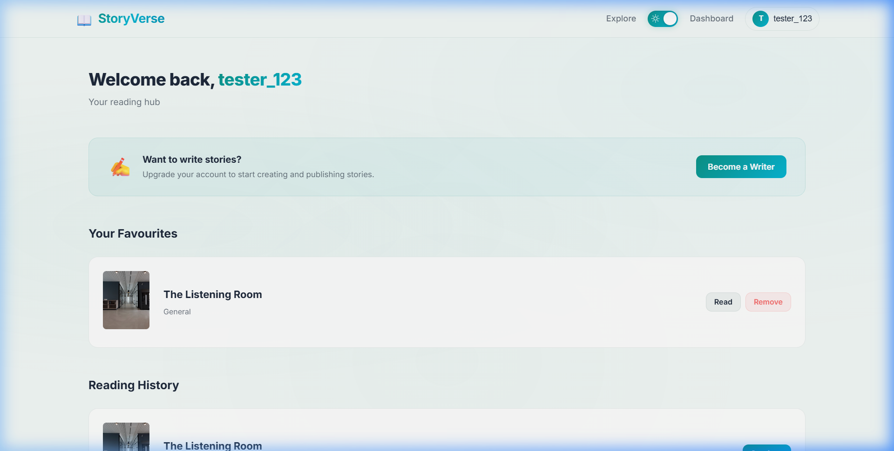
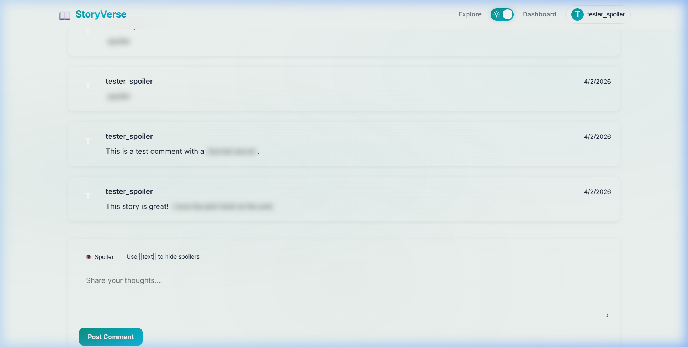
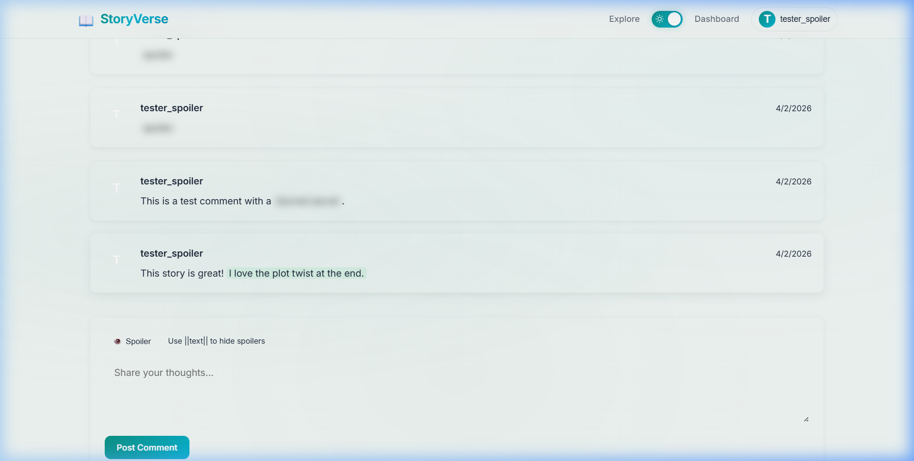
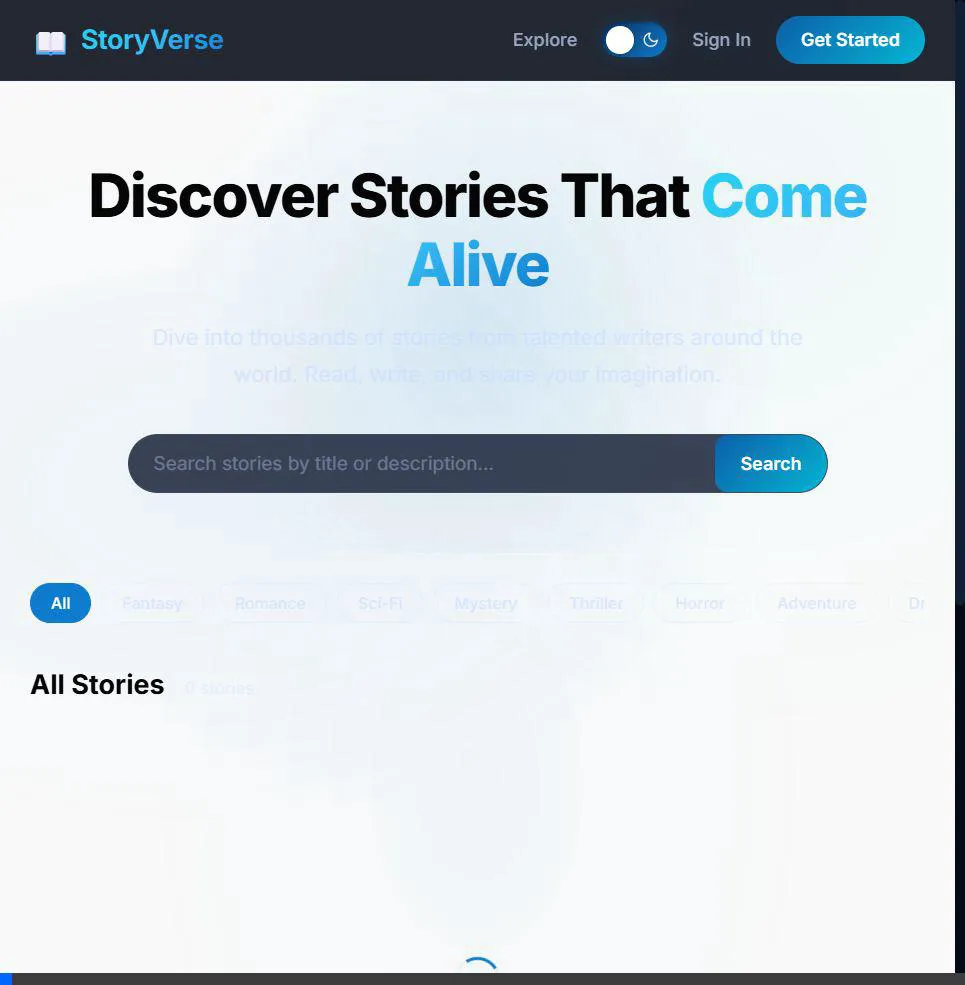

# StoryVerse Phase 1 — Walkthrough

## What Was Built

StoryVerse Phase 1: a complete full-stack social narrative publishing platform with user management and core reading/writing mechanics.

## Tech Stack

| Layer | Technology |
|-------|-----------|
| **Frontend** | React 19 + Vite, React Router v6, Axios, React Quill |
| **Backend** | Node.js + Express, JWT Auth, bcryptjs, express-validator |
| **Database** | PostgreSQL 18 with UUID, enums, triggers |

## Project Structure

```
Build/
├── database/
│   └── schema.sql                 # PostgreSQL schema (6 tables, enums, triggers)
├── server/
│   ├── .env                       # Environment config
│   ├── package.json
│   └── src/
│       ├── index.js               # Express entry (15 API endpoints)
│       ├── config/db.js           # PostgreSQL pool
│       ├── middleware/            # Auth (JWT), error handler
│       ├── controllers/          # Auth, User, Story, Chapter logic
│       └── routes/               # API route definitions
└── client/
    ├── index.html
    ├── vite.config.js
    └── src/
        ├── App.jsx                # React Router (11 routes)
        ├── App.css                # Design system (CSS variables, dual themes)
        ├── context/
        │   ├── AuthContext.jsx    # Auth state management
        │   └── ThemeContext.jsx   # Light/Dark theme toggle + localStorage
        ├── services/api.js        # Axios + interceptors
        ├── components/
        │   ├── Navbar.jsx         # Navigation + theme toggle
        │   ├── ThemeToggle.jsx    # Animated sun/moon toggle switch
        │   ├── ThemeToggle.css    # Toggle styling
        │   ├── Footer.jsx
        │   └── ProtectedRoute.jsx
        └── pages/                 # 9 full pages (see below)
```

## Pages Built

| Page | Route | Features |
|------|-------|----------|
| **Home** | `/` | Hero with search, genre filters, story grid, pagination |
| **Login** | `/login` | Split-panel layout, form validation, error handling |
| **Register** | `/register` | Username/email/password, visual role selector (reader/writer) |
| **Dashboard** | `/dashboard` | Stats cards, story list with CRUD actions, Reading History, Favourites |
| **Story Editor** | `/story/new`, `/story/:id/edit` | Title, description, genre, cover, status toggle |
| **Chapter Editor** | `/story/:id/chapter/new` | **React Quill** rich text editor, draft/publish, word count |
| **Story Detail** | `/story/:id` | Cover, author info, chapter list, start-reading, Favourite button, **Comment section (w/ Spoilers)** |
| **Story Reader** | `/story/:id/read/:chapterId` | Font size controls, prev/next navigation, Merriweather serif |
| **User Profile** | `/profile/:id` | Avatar, bio, role badge, inline editing, published stories |

## API Endpoints (15 total)

| Category | Endpoints |
|----------|-----------| 
| **Auth** | `POST /api/auth/register`, `POST /api/auth/login`, `POST /api/auth/logout`, `GET /api/auth/me` |
| **Users** | `GET /api/users/:id` (public profile), `PUT /api/users/profile` (update own), `GET /api/users/history`, `POST /api/users/history`, `GET /api/users/favourites`, `POST /api/users/favourites`, `DELETE /api/users/favourites/:id` |
| **Stories** | `GET /api/stories` (list + search), `GET /api/stories/:id`, `POST /api/stories`, `PUT /api/stories/:id`, `DELETE /api/stories/:id`, `GET /api/stories/:id/comments`, `POST /api/stories/:id/comments` |
| **Chapters** | `GET /.../chapters`, `GET /.../chapters/:id`, `POST /.../chapters`, `PUT /.../chapters/:id`, `DELETE /.../chapters/:id` |

## How to Run

### 1. Database
```bash
# Make sure PostgreSQL is installed and running
psql -U postgres -c "CREATE DATABASE storyverse;"
psql -U postgres -d storyverse -f database/schema.sql
```

### 2. Backend
```bash
cd server
npm install
npm run dev     # starts on http://localhost:5000
```

### 3. Frontend
```bash
cd client
npm install
npm run dev     # starts on http://localhost:5173
```

## Design Highlights

- **Dual theme system** with animated toggle switch in the navbar
  - **"Oceanic Sapphire" (Dark, Default):** Deep midnight blue backgrounds, ocean-to-neon-cyan gradient accents, soft white/pale cyan text, glassmorphism cards
  - **"Mint Breeze" (Light):** Crisp white/pale mint backgrounds, mint-to-cyan gradient accents, charcoal/slate text, subtle drop shadows
- Theme choice persists across sessions via `localStorage`
- Smooth ~0.3s CSS transitions between themes on all elements
- ~100 CSS custom properties for full design-system theming
- Micro-animations (hover lifts, floating icons, error shakes)
- Fully mobile-responsive (all pages)
- Dual typography — Inter for UI, Merriweather for reading
- Glassmorphism navbar, custom scrollbar, gradient buttons
- JWT auth with HTTP-only cookies + Bearer token fallback
- React Quill rich text editor with theme-aware overrides
- Distraction-free reading interface with adjustable font size

## Demo Account

You can use the following test account to explore the application:
- **Username/Email**: `demo_user` / `demo@example.com`
- **Password**: `Demopass123!`

## Application Gallery

Here are some previews of the StoryVerse platform in action:

**Home Page — Dark Mode (Oceanic Sapphire)**


**Home Page — Light Mode (Mint Breeze)**


**Register Page — Dark Mode**


**Register Page — Light Mode**


**Dashboard — Reading History & Favourites**


**Comments Section — Discord style blurring!**



**Theme Toggle Demo**


## Verification Results

- **Backend:** 131 packages, 0 vulnerabilities, connected to PostgreSQL
- **Frontend:** 837 modules transformed, 0 errors
- **Database:** 3 tables, 3 enum types, 8 indexes, 3 triggers
- **Browser:** All UI components render correctly in both themes
- **API:** Health check and story endpoint return 200 OK
- **Theme:** Toggle persists via localStorage, smooth transitions on all pages
